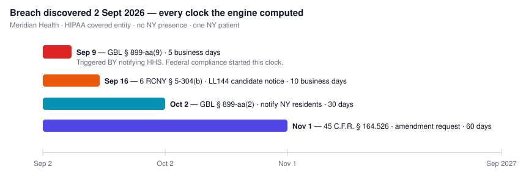
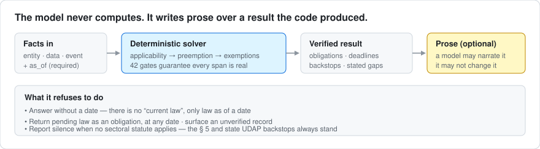

# PRIVACY-KB

A citation-anchored, time-indexed model of US federal privacy law, with a New York state layer.
Every obligation is quoted verbatim from primary source, carries the hash of the bytes it was
verified against, and resolves as of a date.

[](https://github.com/rakib-nyc/privacy-kb/actions/workflows/ci.yml)

> ## ⚠️ Experimental research project — not legal advice
>
> **This is a research prototype. It is not a legal product and it is not legal advice.** No
> warranty or guarantee of any kind is made as to accuracy, completeness, currency or fitness for
> any purpose. See the disclaimer of warranty and limitation of liability in [`LICENSE`](LICENSE)
> (Apache 2.0, §§ 7–8), which govern.
>
> **Parts of this corpus were assembled with AI assistance, and AI makes mistakes.** So do people.
> The verification apparatus in this repository — 42 CI gates, hash-anchored spans, adversarial
> red-teaming — exists because that is true, not because it has been solved. It reduces certain
> classes of error; it does not eliminate them, and it cannot catch a misreading that is
> internally consistent. Several such errors were found *after* shipping and are documented in
> [`meta/red-team-0.1.md`](meta/red-team-0.1.md) and [`meta/validation-events.yaml`](meta/validation-events.yaml).
>
> **Every output must be checked by a qualified human against the primary source before it is
> relied on.** Every record carries its source URL, fetch date and content hash precisely so that
> checking is possible — that is the point of the design. Do not skip it.
>
> Law changes. A record is accurate as of its stated `effective_from`/`effective_to` and the date
> its source was fetched, and not otherwise. Nothing here creates an attorney–client relationship.

> **Licensing:** [Apache 2.0](LICENSE) for the original work. Quoted legal text is government
> edict and carries no copyright. See [`NOTICE`](NOTICE) and [`PROVENANCE.md`](PROVENANCE.md).

## What it does, on a real company

**Meridian Health** — a telehealth startup. Delaware incorporated, offices in Austin. **No New
York office and no New York employees.** It has New York patients, hires in New York City with an
automated screening tool, and has minors on its platform.

On a naive reading, a Texas company with no New York presence has no New York exposure. Ask this
system what happens after a breach on 2 September 2026 and it computes every clock at once:



**The earliest deadline is one that doing the federal thing correctly created.** N.Y. Gen. Bus.
Law § 899-aa(9) gives a HIPAA covered entity five business days *from notifying the Secretary of
HHS* to notify the New York Attorney General. The clock does not start on discovery. A company
that files federally and then works through its 30-day and 60-day obligations has, by day six,
already missed the first one on the list.

Three things a naive answer gets wrong here, and this one does not:

- **There is no nexus threshold.** § 899-aa attaches to *holding a New York resident's private
  information*. No office, no employees, no revenue floor — one patient is enough.
- **HIPAA does not preempt it.** 45 C.F.R. § 160.203 makes HIPAA a **floor**, so more stringent
  state law survives. The posture is resolved, not assumed.
- **The compliance-deemed pathway does not rescue it.** § 899-aa(2)(b) is typed `activity_level`,
  not `entity_level`: it removes notice to people already notified federally and expressly
  preserves notice to the Attorney General.

It is equally willing to refuse. The SAFE for Kids Act is enacted, final, and binds nobody until
2027 — it routes to a watch feed that cannot become an obligation *at any as-of date*. And the
§ 1501 answer comes back honest but incomplete, because what "commercially reasonable and
technically feasible" actually requires lives in a regulation this corpus does not hold, and it
says so rather than guessing.



**[→ Full worked example](examples/README.md)** — four scenarios, every figure live engine output,
reproducible with `node examples/run-scenario.mjs`.

### Working on it

Read `BRIEF.md` first — it is the standing brief, and the invariants in §3 are correctness
properties rather than preferences. `SCHEMA.md` freezes the record shape. `CORPUS-MANIFEST.md` is
the work queue. `PROMPTS.md` is the session playbook.

## State of the build

A working vertical slice: corpus → engine → MCP server → workflows, with the verification
apparatus that makes the corpus trustworthy. Breadth across the full manifest is not done and
is the honest remaining work.

| | |
|---|---|
| Records | **248** — 218 obligation, 9 authority, 5 definition, 5 principle, 3 doctrine, 5 workflow_constraint, 2 taxonomy, 1 enforcement_action |
| Verified | 244 `verbatim_confirmed` · 4 suppressed by invariant I1 and unreachable from any output |
| Instruments | 54 declared · **53 complete** against their declared duty categories |
| taxonomy leaves covered | 31 / 69 · 38 neither covered nor ruled out of scope, and gate 34 ratchets that number |
| CI gates | **42**, all named · 56 fixtures · 31 gates fixture-exercised, 11 declared unexercisable in `tests/fixtures/no-fixture.yaml` and why |
| Walker assumptions | 13 declared, 13 with an executable test |
| Engine | 7 modules · 7 property tests, including both halves of invariant I6, as-of validation, and totality of every entry point |
| MCP server | 9 tools, 22 tests including a live stdio handshake |
| Workflows | 4 lifecycle-indexed, 26 tests |
| Eval scenarios | 30, all-pass baseline enforced by gate 8 |

**New York is built, not blocked.** SHIELD, the Child Data Protection Act and its OAG guidance,
the SAFE for Kids Act, GBL §§ 349/350, Education Law § 2-d, Civil Rights Law §§ 50/51 and § 52-c,
Penal Law §§ 250.00/250.05, and NYC Local Law 144 with its 6 RCNY implementing rules. Two
declared instruments remain unheld: 23 NYCRR Part 500, for which no consolidated machine-readable
text exists, and N.Y. Exec. Law § 202-a. Both are declared rather than silently absent — see
`meta/blocked-sources.yaml`.

**The SAFE for Kids Act is the reference case for invariant I2.** It is enacted, its text is
final, and it binds nobody until 2027-01-25 — so every one of its records is `enacted_pending`
and the engine routes them to a watch feed that can never become an obligation, at any as-of
date. It is also what made that property test non-vacuous: until it landed, the test guarding
invariant I3 was passing over an empty set.

### What this repository does not ship

Only primary legal text is stored. Third-party reference documents are not redistributed here,
and records that could not be verified against a file this repository holds were removed rather
than kept as unverifiable shells — see `meta/decisions.yaml` DEC-008.

Everything the corpus quotes is US, New York or New York City legal text: government edicts,
which carry no copyright.

### What was found by attacking it

0.2 is 0.1 after a red-team pass. Sixteen findings, and the ones that mattered were not crashes —
they were records that were **verbatim, uniquely cited, internally consistent and wrong**:

- A span could quote § 1501(5) while citing § 1501(1). Every one of the 38 gates passed it,
  because each checked the span against the *document*, the path against the *segmentation*, and
  the path against the *citation* — and none checked the span against **its own path**. Now gate 39.
- A span cut one word before `unless` is genuinely verbatim and states the opposite rule. Now gate 40.
- `as_of` was required but never validated. Comparisons are string comparisons, so `'not-a-date'`
  sorted above every ISO date and *widened* the answer: 5 obligations for a real date, 7 for
  garbage — the extra two being law that does not bind until 2027.
- **Gate 22 did not exist.** It sat in the gate list with no implementation, reporting
  examined-nothing on every run. It is now the check that no gate can be listed and unimplemented.
- A **malformed predicate** — `entity.x == true || nonsense(` — passed all 42 gates while
  comparing against the literal text `"true || nonsense("`. Grammatical, evaluable, satisfiable,
  and permanently false: an obligation that could never apply and nothing saying so.
- An **unrecognised preemption posture** resolved to `no_displacement` — the most permissive
  answer available — because it shared a `default:` branch with `none`.

Twenty findings across three passes. Each has a gate, a fixture or a property test, and every
attack is replayable: `bash tests/red-team-replay.sh`. Full account in `meta/red-team-0.1.md`.

## Architecture

```
corpus/     verified records — the only source of truth. Nothing is synthesised at query time.
engine/     deterministic solver. NO LLM in this path (invariant I8). 
mcp/        nine read-only tools over corpus + engine.
workflows/  lifecycle deliverables, each verified against its own checklist before return.
tools/      acquisition, rendering, gates, and the guards on all of them.
meta/       taxonomy transcriptions, coverage, debt, blocked sources, validation events.
```

The split that matters: **the corpus supplies the truth, the calling model supplies the
prose.** The engine never asks a model anything and the model never computes applicability.

## Gate ledger

Every gate is named, and every gate has two fixtures: one proving it **fires** on
known-bad input, one establishing it is examining a **real haystack**. A gate that
examines nothing looks exactly like a gate that passes. `tools/validate.mjs` prints
per-gate examination counts on every run; `tests/fixtures/NON-VACUITY.md` carries the
non-vacuity argument for each, including the ones where the concept does not apply.

| # | Gate | Fires fixture | Non-vacuity |
|---|---|---|---|
| 1 | JSON Schema, incl. derived `risk_tier` | `gate1-bad-enum`, `gate6-legacy-coordinate` | structural — ajv compiles at startup |
| 2 | `raw_sha256` resolves and matches | `gate2-hash-mismatch` | fail-safe |
| 3 | span is an exact substring, reconstructed through `span_interruptions` | `gate3-fabricated-quote`, `gate3-subtly-reworded` | `nonvacuity3-collapsed-haystack` |
| 4 | nothing `in_force` from the future | `gate4-future-in-force` | n/a — field comparison |
| 5 | state atoms declare `federal_relationship` | `gate5-state-no-fedrel` | n/a — field presence |
| 6 | taxonomy coordinate exists | `gate6-nonexistent-leaf` | fail-safe |
| 7 | `notify` obligation carries a deadline | `gate7-notify-no-deadline` | n/a — field presence |
| 8 | eval suite runs; no regression, no scenario deletion | runner exit path | executes `evals/runner.mjs` |
| 9 | principle ≠ obligation ≠ scheme | `gate9-binding-no-tier`, `gate9-framework-claims-adherence` | n/a — field comparison |
| 10 | cross-references resolve | `gate10-dangling-xref` | fail-safe |
| 11 | independent renderer agrees, exhaustively | `gate11-baseline-offset` | `nonvacuity11-empty-alt-render` |
| 12 | visual spot-checks cover every feature present | `gate12-no-visual-check` | assertion is the gate |
| 13 | unanchored records justified | `gate13-unanchored-no-justification` | n/a — field presence |
| 14 | **vacuity** — a haystack collapsed | both `nonvacuity*` fixtures | the gate that makes the others non-vacuous |
| 15 | **apparatus** — no apparatus inside a span | `gate15-apparatus-in-span` | `scan-features.py --check` in CI |
| 16 | **path confidence** — low confidence refuses the atom | `gate16-low-confidence`, `gate16-reconstructed-on-uslm` | n/a — field comparison |
| 17 | **notes anchoring** — no operative atom inside `<notes>` | `gate17-anchored-in-notes` | extraction must return non-null |
| 18 | **operative context** — nested text needs its context | `gate18-nested-no-context`, `gate18-other-without-note` | n/a — field presence |
| 19 | **declaration integrity** — every gate×format declared, gaps accepted in writing | `meta/gate-applicability.yaml` | assertion is the gate |

**Applicability is declared, not inferred.** `meta/gate-applicability.yaml` classifies every
gate against every source format as `APPLIES` / `ANALOGUE-REQUIRED` /
`INAPPLICABLE-BY-DESIGN` / `UNGUARDED-GAP`, and gate 19 asserts it. Every zero in the
examined counter resolves to a declaration — `g16:n/a(declared)`, `g5:n/a(no obligation
records)`, `g8:0(examined)` — never a bare number. This exists because gates 11 and 12
silently stopped executing on XML and it took three sessions to notice.

**Context is quoted law, not annotation.** `operative_context[]` is ordered and
bidirectional, and each entry's `verbatim_span` is gate-3 verified in its own right. It is
deliberately not called a stem: USLM `<continuation>` puts the operative consequence
*after* the enumerated list — the chapeau is the *if* and the continuation is the *then* —
and there are 468 of them in title 15 alone.

## authority_tier is derived, not judged

`tools/authority-tier.mjs` is the decision procedure. Every atom runs through it, so
ambiguity there would become ~900 inconsistent judgement calls.

It separates three axes that are easy to collapse and shouldn't be:

- **`authority_tier`** — what kind of instrument this is. A property of the *instrument*.
- **sourcing posture** — how confident we are that the text quoted *is* the enacted text.
  A property of the *source it was read in*.
- **`status`** — whether it currently operates. A property of the instrument *in time*.

A stayed legislative rule is still a legislative rule. The same FCRA obligation read in the
U.S. Code and in the Statutes at Large has one tier and two sourcing postures.

The hinge is **5 U.S.C. § 553(b)(A)**: notice-and-comment does not apply to "interpretative
rules, general statements of policy, or rules of agency organization, procedure, or
practice". A rule that went through it is legislative and carries the force of law; one that
did not, does not. That makes the regulation/guidance line mechanical rather than a
judgement call — and it is why the procedure **refuses** when the § 553 basis is unknown
rather than guessing.

**It refuses rather than guesses**, and names the input it needs. A refusal costs one human
decision; a guess costs a wrong answer nobody looks at again.

## The Code is usually not the law

Under **1 U.S.C. § 204(a)** the Code establishes the laws *prima facie*; only where a title
has been enacted into positive law is the Code text *legal evidence* of the law.

**Six of the eight U.S. Code titles carrying Priority 1 are not positive law** — 12, 15, 20,
42 and 47, which between them hold FCRA, GLBA, the FTC Act, COPPA, CAN-SPAM, FERPA, HIPAA,
HITECH, TCPA and CPNI. Only 18 (VPPA, DPPA, ECPA) and 5 (Privacy Act, FOIA) are positive law.
The prima facie posture is this corpus's default, not its edge case.

The policy: **the USLM Code is the default source**, and the enrolled act is pulled only when
OLRC flags a divergence editorially *and* the flagged text falls inside a span. That trigger
is not hypothetical — `<note type="footnote">So in original. Probably should be "which".</note>`
sits inside an operative sentence in 15 U.S.C. § 1681c(f).

`meta/positive-law-titles.yaml` is generated from USLM's own
`<property role="is-positive-law">` element — never a hand-maintained list — and an atom
citing a title it does not cover **fails** rather than defaulting.

## A false gap is quieter than a false all-clear, and just as wrong

`engine/backstops.mjs` resolved the state UDAP statute — invariant I6's other half — by testing
`/udap|deceptive/` against the atom **id**. GBL § 349 landed in the corpus as
`ny.gbl.349.a.unlawful` and siblings, containing neither word. So the corpus held the New York
UDAP statute, and the engine reported it **unavailable** — and attributed the absence to a NY
Senate API-key blocker that had been resolved months earlier.

That last part is the serious one. The system did not merely fail to find something it had. It
produced a confident, plausible, **fabricated explanation for a gap that did not exist**. A reader
would have reached the right next action — "no NY UDAP analysis here, go check it yourself" — for
entirely fictional reasons, and would then have gone off to chase an API key that was already
working.

Everything about that output looked healthy. It was specific, it cited a file, and it was wrong in
a direction nothing was watching, because a missing analysis reads as caution rather than as error.

## Absence must be assessed against what SHOULD be there, never against what happens to be there

This is the recurring shape of every real defect in this project, and it has now appeared four
times in four different disguises:

| Where | The test that failed | What it missed |
|---|---|---|
| `backstops.mjs` | does an atom id contain "udap"? | a UDAP statute that was present |
| instrument coverage | does this instrument have atoms? | FCRA's duties, behind a correct preemption answer |
| `findGaps` / breach workflow | does this jurisdiction have any atoms? | GBL § 899-aa, while three § 349 atoms said "covered" |
| eCFR segmentation | *(nothing asked)* | 133 provisions swallowed into their predecessors' text |
| OpenLegislation `repealed` | is the flag set on the fetched document? | the API returns `null` there; only the law TREE carries it |

The fix is the same inversion each time: **declare the denominator, then compare**.
`meta/jurisdiction-coverage.yaml` lists what each jurisdiction is supposed to hold, transcribed
from `CORPUS-MANIFEST.md`, and `engine/coverage.mjs` names what is missing. `meta/ny-repealed.yaml`
is generated from the law tree, and any law absent from it fails. Gate 23 refuses a citation into
an ambiguous path. Gate 25 refuses a jurisdiction with atoms and no declaration.

Three varieties of denominator defect have now appeared, and they get progressively quieter:
an entry that is **missing**, an entry that is **wrong** (Labor Law § 203-f, "Inventions made by
employees", claimed as the electronic-monitoring notice for the whole project), and an entry that
**resolves correctly and still does not supply what is claimed for it** — GBL § 899-ee publishes as
"Definitions" while the declaration lists three duty types against it. Hence `expected_sections`:
naming the instrument is not naming where the duties live.

Coverage is declared, never inferred from presence. Covering a jurisdiction is not covering a duty,
and **holding an instrument's preemption atoms is not being able to answer questions about it**.

The FCRA row is the one worth dwelling on, because it is the only entry that no gate could have
caught before it was declared. Every FCRA atom is correct. Every gate passed. The engine behaved
exactly as designed. The corpus simply did not know that "has preemption atoms" and "can answer
questions about this instrument" are different claims, so a consumer-reporting-agency query
returned confident preemption analysis over a substantive void, and nothing in the output said so.
New York's incompleteness was *declared* and therefore self-reporting; FCRA's was merely *true*.
`meta/instrument-coverage.yaml` closes it per duty category, so the answer now names what it
cannot reach — permissible purposes, accuracy, disputes, furnisher duties — by citation.

## Cross-session interface drift: green signals over a dead capability

The most expensive defects in this repo have not been wrong answers. They have been
**capabilities that could not fire while every signal said they worked** — and all of them have
the same cause. A component built in one session assumed an interface another session never
delivered. Nothing connected the two, so each side was internally consistent, individually
tested, and jointly useless.

It has now happened six times, in six different disguises. The disguises are the point — the
fourth arrived through a door the gates built for the first three did not watch — so the pattern
is what has to be remembered rather than the instances.

**1. The schema and the engine disagreed about a field.** `engine/exemptions.mjs` read
`ex.applies_if`. The schema defined the exemption object with `additionalProperties: false` and
no such field. Every exemption evaluated to UNKNOWN and was never applied — invariant I4, the
one BRIEF.md says makes the tool worthless if wrong, was **inert**, under three green signals:
the engine implemented I4, the property tests passed, the schema validated.

The property tests passed because they built exemption objects **carrying `applies_if`** —
objects the schema would have rejected. They proved a function works on input the corpus can
never contain. *That is the difference between testing a function and testing a system.*

**2. The engine read fields the schema never defined.** The general form of (1), and the reason
(1) was not a one-off. Closed by **gate 22** (`tools/check-engine-schema.mjs`), which walks
every record-field access in `engine/` and `mcp/` and fails on any read the schema does not
define. It would have caught DEBT-009 on day one, and no property test could have.

**3. The engine predicated on namespaces it never populated.** `analyze()` hardcoded
`law: {}` while two FCRA preemption atoms predicated on `law.federal_instrument`. The
expressions were grammatical and evaluable, so **gate 21 passed them** — they simply could
never be true. This one is worth stating plainly, because the earlier diagnosis was wrong in
the reassuring direction: the problem was described as "confident preemption analysis over a
substantive void", when in fact **there was never a preemption answer at all**. The two atoms
could not evaluate true under any input. What was confident was the *absence* being invisible.

The gap in gate 21 was exact. **Gate 21 catches a predicate the engine *refuses*. Nothing
caught one the engine *accepts and can never satisfy*.** **Gate 28** closes it by collecting
every namespace any predicate uses and failing on any the engine does not fill — and it
confirmed it was catching a class rather than an instance by finding a second on its first run,
a FACTA atom predicating on a `disposal` namespace that has never existed.

**4. The predicate language's semantics disagreed with the facts model's shapes.** `in` did plain
membership, so `data.types in ['consumer_report']` was permanently false — `['consumer_report']`
is not an *element* of `['consumer_report']`. Grammatical, namespace-clean, gate-28-clean, dead.

This one arrived through a door none of the gates watched, and it was found by **running** the
atom, which is not a thing that happens reliably. The class generalises well past `in`: any
operator whose behaviour depends on whether an operand is scalar or array has the same exposure,
and the next one will be a different operator.

**Gate 29** closes it as a property rather than as a special case. For every predicate it builds a
witness from the predicate itself and requires the engine to return true — an atom no
constructible input can trigger is dead, and dead atoms are exactly what all four instances
produced. Where an operand's shape is ambiguous it tries both, and reports when satisfaction
*depends on which shape is chosen*. Reverting `in` to its old definition makes gate 29 fire on
three atoms, not just the one that was found by hand.

**6. A tool was replaced and the replacement did not inherit an obligation.** A distinct trigger,
and the one to watch after every rewrite. `meta/sources.yaml` is required by BRIEF.md Phase 0 to
log every fetch with its URL and hash. It held **13 entries against 78 stored raw files** — the
ledger stopped being written the moment `tools/extract.py` replaced `tools/fetch-source.mjs` as
the acquisition path, and nothing failed, because gate 2 hashes each atom's *own* `raw_file`
rather than checking the ledger.

Not two components disagreeing: one component superseded, and an undeclared responsibility dropped
on the way. **Every time a tool is rewritten, whatever it was silently responsible for has to be
re-established.** Gate 33 now asserts the correspondence and `extract.py` refuses a fetch it cannot
log — and gate 33 fired on its first run, catching a file that had been hand-copied rather than
fetched.

The sweep that followed found a second: BRIEF.md § 2 calls "every taxonomy leaf is covered or declared
out of scope" *the completeness argument for the whole project*, and **49 of 69 performance
indicators were neither**, with `out-of-scope.yaml` holding zero coordinates. Gate 34 ratchets it.

### The blind spot this does not close: unique-but-wrong

Gate 23 checks that a `paragraph_path` identifies **a** provision. Nothing checks that it
identifies **the right** provision, and a path that is unique and wrong is the one defect shape
this repo has no general answer for.

It nearly shipped. 15 U.S.C. § 1681g is a USLM *large-and-complex* section: the whole body is flat
`<p class="indentN">` with no structural nesting, and `walk_uslm` returned zero leaves for it in
silence. Reconstructing depth from the indent classes recovered **131 leaves** and looked correct
— but the classes are typographic, not hierarchical (the `(a)` heading is `indent2`, its own body
`indent0`), so paragraph (1) came out at `["1"]` instead of `["a","1"]`. Unique. Clean. Citing the
wrong provision. Every gate would have passed it.

That extraction was thrown away and the walker now refuses the variant, because a green build over
a wrong citation is worse than a red one. § 1681g stays absent and
`meta/instrument-coverage.yaml` keeps reporting `consumer_disclosures` as a category FCRA cannot
reach.

**Gate 30** is a partial guard, not a solution. Where a path is *reconstructed* rather than read
from the source, the human-written citation is an independent witness: if the record says
`15 U.S.C. § 1681g(a)(1)` then the path had better be `["a","1"]`, and it is compared against the
citation's **trailing** designator run so a truncated path cannot slip through as a substring. It
would have caught the 1681g case, and it caught two real disagreements on its first run over the
existing corpus. It will not catch a path that is wrong in the same way its citation is wrong.

Expect this to recur wherever markup is typographic rather than hierarchical — older USLM
sections, bill text, agency PDFs — and expect the recovered-131-leaves instinct to be strong.

**5. Two components independently invented the same wrong assumption.** A different sub-shape,
and the one that will keep happening. `walk_openleg` and `walk_ecfr` both encoded "a paragraph
needs a designator" — separately, from the same unstated premise. It was found and fixed in the
openleg walker for N.Y. GBL § 350, and found again two days later in the eCFR walker, where it had
silently dropped **16 C.F.R. § 314.6, the Safeguards Rule's size-threshold exemption**, from a
corpus whose headline invariant is typed exemptions. Part 314 extracted §§ 314.1–314.4 and
stopped; the raw has six sections. Fixing one walker did not fix the other, because the assumption
was never written down anywhere.

The countermeasure is not a gate — nothing in the corpus can see a provision that was never
emitted. It is `meta/extractor-assumptions.yaml`, which states the premises a legal-text walker
must not hold, and `tools/test-extractors.py`, which asserts every walker against every one of
them. **A new walker is not finished until it passes that file.** Nine assumptions are declared,
six have executable tests, and the three that do not are listed as not-yet-executable rather than
quietly omitted. Writing the register immediately produced a failure: the hard-wrapped
cross-reference guard turned out to handle only the case where a designator repeats itself, not
the general one.

## A brief's citation is a hypothesis

Every machine-checkable layer here is guarded. `verbatim_span` is verified, `paragraph_path` is
verified, predicates are verified, quoted phrases are verified. **The instructions are not, and
they have been wrong five times** — see `meta/validation-events.yaml`. Four of the five were one
shape: a claim about what a NAMED provision does.

`tools/check-brief.py` resolves every citation in a brief against the corpus and prints the
source's own **section heading** beside the sentence the brief wrote around it. It makes no
semantic judgement — that heuristic was tried for gate 31 and produced false alarms and false
comfort in equal measure. It just puts the two strings next to each other:

```
  29 U.S.C. § 157
      published : Right of employees as to organization, collective bargaining, etc.
      brief says: ...its privacy relevance is that it CONSTRAINS EMPLOYER MONITORING...

  18 U.S.C. § 1514A
      published : Civil action to protect against retaliation in fraud cases
      brief says: ...creates a CONFIDENTIALITY constraint on internal investigations...
```

Run it before extraction begins. It catches mis-aimed citations, not misread provisions — the
PPRA written-consent error survives it, because that heading is consistent with the claim and the
mistake was in the detail of a two-limb rule.

## A gate that cannot see its input is indistinguishable from a gate that passes

Gate 23 checks that a `paragraph_path` resolves to exactly one provision. It resolves against the
segmentation sitting beside the atom's raw file — and for records whose segmentation had never
been promoted into the corpus, it simply skipped them. **Fourteen atoms were invisible to it for
their entire existence.** The moment their files arrived, COPPA § 312.3's `["a"]` turned out to
resolve to six different provisions and two HIPAA breach paths to resolve to nothing.

The gate had been reporting a number the whole time. `g23:34` and `g23:69` look equally healthy if
you do not know which one is the denominator. This is the same defect as coverage-by-presence, one
level up: **the gate's own coverage was never declared, so its silence read as approval.**

**Gate 32** closes it. A gate that declines to examine a record must record a reason, and the
reasons are split into ones accepted in advance (a principle has no paragraph to cite) and ones
that mean the gate is blind (`no-segmentation-beside-source`). The second kind fails the build. It
fired immediately on sixteen more records — every authority atom, plus FACTA and FCRA preemption —
and gate 23 went from 34 examinations to 69.

### What the six have in common

Each side was correct. Each side was tested. Nothing tested the *seam*, and a seam is invisible
precisely because both halves look healthy from the inside. The countermeasure is not more
tests on either side — it is a check that reads one artifact and validates it against the
other:

| Check | Reads | Validates against |
|---|---|---|
| Gate 22 | engine field accesses | schema properties |
| Gate 28 | atom predicate namespaces | the facts object `analyze()` builds |
| Gate 29 | every predicate | a witness the engine must actually evaluate true |
| Gate 26 | stored `differs_from` | recomputation from the elements |
| Gate 27 | instruments with obligations | declared duty categories |

When a check like this produces a false positive — and gate 22 has produced several — the fix
is to rename the ambiguous variable, never to widen the check. `c` became `corpus`, `a` became
`cat`. A suite dies by a thousand reasonable exceptions.

### The same shape one level down

Gate 20: OpenLegislation exposes `repealed` on law-*tree* nodes but returns `null` for it on
directly-fetched documents, so a guard reading the stored document would have passed every
repealed section while looking like it worked. The fix is the same inversion — generate the
table from the tree, and **fail on any law not in it**.

## Determinism with respect to the law, not to the corpus state

Invariant I2 says a query resolves *as of a date*: the same facts and the same `as_of` give the
same answer. That guarantee is worthless if the answer also varies with how much of the corpus
happens to have been extracted.

The question arose over partially-extracted instruments (DEC-007). The corpus holds FCRA's
preemption provision and none of its duties. Should the preemption atoms be withheld until the
instrument is substantively complete?

No — and the reason is not that a fragment is useful. It is that withholding would make an
instrument **vanish from the analysis as a side effect of extraction progress**, so the same
query would return different law on different days for reasons having nothing to do with the
law. Corpus growth may change what the system says it **cannot reach**. It must not silently
change what it says the law **is**.

So a partial instrument answers, and carries a structural caveat naming what it cannot reach —
`instrument_completeness` on the applicable entry plus an independent `coverage_gaps` line, both
by citation. Not a reasoning string: a caveat that lived only in prose would repeat migration
005's mistake, where `reach` was recorded and the explanation stayed generic.

The caveat's wording is load-bearing too. *"Correct as far as it goes and CANNOT reach ... Treat
those questions as unanswered rather than as answered in the negative."* The last clause is the
one that matters — silence about a duty is not evidence there is no duty.

## Apparatus policy

**Apparatus** is anything the publisher added around the text rather than enacting as
text: footnote and endnote reference markers, footnote text, page numbers, running heads
and feet, line numbers, watermarks, revision bars, column rules, and editorial brackets in
an official rendering.

**A `verbatim_span` is never edited to remove apparatus.** Apparatus is excluded by
choosing span boundaries — never by deletion. Deleting a character puts an unrecorded
transformation between the source and the quotation, which is precisely what invariant I1
exists to forbid.

Where operative text is unavoidably interrupted by apparatus mid-sentence, record it in
`span_interruptions[] {offset, excluded_text, kind}`. Gate 3 then **rebuilds** the raw
substring by re-inserting every entry at its offset and requires the result to appear in
the source, so the removal is mechanically reversible and the operative words cannot be
changed without breaking reconstruction.

This is preferred over splitting the span, because splitting loses the fact that it is one
sentence — and a sentence is often the unit an obligation lives in.

Gate 11 handles interrupted spans differently: the two renderers spell apparatus
differently (poppler emits `certification 1 .` where pdfplumber emits `certification1.`
for the same marker), so it requires each **operative segment** to appear in the
independent rendering in order, rather than reconstructing with one renderer's spelling
and searching the other's output.

Gate 15 enforces the policy. Its text patterns catch Unicode superscripts and page-of-N
feet, but a superscript **flattened into ordinary digits** by the renderer is
indistinguishable from operative text by regex — that is exactly how `participating APEC
economies10.` got into a span. So gate 15 also consults `meta/source-features.yaml`, which
reads glyph heights out of the PDF and sees the marker regardless of how it was flattened.


## Rendering sources for gate 3

Gate 3 checks a span against the stored source, so when the source is a PDF or HTML page
it has to be rendered first — and that rendering has to be reproducible, or the check runs
against a haystack nobody can regenerate. `tools/render-text.py` is the only sanctioned
renderer, and the exact command is recorded in each record's `source.text_extraction_cmd`.

It has three options that exist because legal PDFs broke the naive version:

- `--column left:<x>` — two-column instruments (APEC, Global CBPR) put the principle left
  and commentary right. `pdftotext -layout` splices them onto one line, which would splice
  a quotation with commentary that is not part of it.
- `--min-height <pt>` — footnotes set smaller than body text and otherwise land in the
  middle of a quoted provision. Thresholds are per-document (APEC body 11.7pt, Global CBPR
  body 14.65pt).
- `--drop-re <regex>` — page furniture (running heads, rule lines) that interrupts a
  provision. Explicit rather than automatic, so what was stripped is visible in the command.

Note what gate 3 does *not* cover: it proves a span is faithful to the rendering, not that
the rendering is faithful to the document. A subparagraph-marker bug in the column
extractor once produced `"with the consent of the individual a) whose ..."` and every gate
passed. Three checks now close that gap:

- **Gate 11** re-renders every `pdf_*` source with pdfplumber (pdfminer's layout engine,
  no shared code with poppler) and requires the span to appear in both. It is
  **exhaustive, not sampled**: you cannot predict from a document's shape whether a
  renderer fault manifests in it. The APEC Privacy Framework sets its subparagraph
  markers on the same baseline as their text and hid the identical bug through an entire
  instrument, while the Global CBPR Framework exposed it immediately.
- **Gate 12** rasterises the page and has the passage read back off the image — the only
  check that inspects the document rather than a transformation of it. Sampled, minimum
  three per high-risk instrument, logged in `meta/visual-checks.yaml`.
- **`tools/ancestry-diff.mjs`** diffs a record against the record it descends from and
  flags differences too small to be real legal change.

Every gate also carries a non-vacuity argument — a gate examining nothing looks exactly
like a gate that passed. `tools/validate.mjs` prints per-gate examination counts on each
run, gate 14 fires when a haystack collapsed, and `tests/fixtures/NON-VACUITY.md` records
the argument for all fourteen.

And the first defence is not to render at all: `source.format` and `source.structured_source_check`
make a structured source mandatory-or-explain, because XML and HTML do not have this failure
mode. The OECD records moved from PDF to the official HTML rendering for exactly that reason.

## Layout

```
meta/           taxonomy transcriptions, source ledger, drift register, raw taxonomy PDFs
schemas/        JSON Schema for the atom
tools/          fetch harness, CI gates, gate self-tests, fact-key vocabulary
tests/fixtures/ one atom per gate, each built to fail
corpus/         obligation atoms — empty, Phase 1
engine/         deterministic solver — empty, Phase 2
mcp/            MCP server — empty, Phase 4
workflows/      lifecycle-indexed deliverables — empty, Phase 4
evals/          scenarios — empty, written alongside Phase 1
```

## Registered debt

`meta/debt.yaml`. Two open items, each with a named trigger:

- **DEBT-001** — FTC Act § 5 attaches to a public claim of adherence to any framework.
  That is a property of § 5, so it belongs in the § 5 atoms rather than duplicated onto
  each framework. Trigger: Priority 1 Domain II.A.
- **DEBT-002** — all 41 principle and scheme records have an empty `derived_obligations[]`.
  A principle that instantiates no obligation is a quotation, not knowledge. **Phase 1
  exit criterion:** every such record gains at least one derived obligation or is demoted.
  **Moratorium:** no further principle records until then.

## Before Phase 1

`meta/taxonomy-drift.yaml` holds 9 structural findings and 7 unverified subject-matter flags.
**D-04 and D-05 are open owner decisions that affect build order.** D-09 notes the taxonomy is
17 months past approval and should be re-checked for a newer version.
